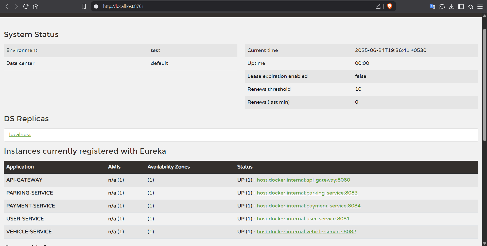

# 🚗 Smart Parking Management System (SPMS)

A **cloud-native microservice-based backend application** for managing real-time parking reservations, vehicle registrations, user management, and mock payment processing.

---

## 📘 Overview

Urban parking has become a major challenge due to increased population and vehicle density. SPMS helps address this issue by offering a real-time, scalable solution for:

-  Searching and reserving parking
-  Registering vehicles
-  Managing users
-  Handling payments
-  Tracking activity and usage

---

## 🧱 Microservices Architecture

|  Microservice        |  Responsibility                                        |
|----------------------|--------------------------------------------------------|
|  **Eureka Server**   | Registers & discovers all services                     |
|  **Config Server**   | Centralized configuration for all microservices        |
|  **API Gateway**     | Routes external requests to correct service            |
|  **User Service**    | Handles user registration, login, and profiles         |
|  **Vehicle Service** | Manages vehicle registration and links to users        |
|  **Parking Service** | Manages parking spot availability and reservations     |
|  **Payment Service** | Simulates payments and generates digital receipts      |

---

## 🛠️ Technologies Used

- Spring Boot
- Spring Cloud (Eureka, Config, Gateway)
- Spring Web & Spring Data JPA
- RestTemplate (for inter-service communication)
- Postman (API testing)
- MySQL (database)
- GitHub for version control

---

## 🚀 Getting Started

1.  Start **Eureka Server** at `http://localhost:8761`
2.  Start **Config Server**
3.  Start the services in this order:
     - API Gateway
     - User Service
     - Vehicle Service
     - Parking Service
     - Payment Service
4.  Access all services via **API Gateway**
5.  Verify registration on the **Eureka Dashboard**

---

## 📁 Folder Structure
- `SPMS/`
  - `api-gateway/` –  API Gateway service
  - `config-server/` –  Configuration Server
  - `eureka-server/` –  Eureka Discovery Server
  - `user-service/` –  User Management Microservice
  - `vehicle-service/` –  Vehicle Management Microservice
  - `parking-service/` –  Parking Space Microservice
  - `payment-service/` –  Payment Handling Microservice
  - `docs/`
      - `postman_collection.json` –  Postman API test collection
      - `eureka_dashboard.png` –  Eureka dashboard screenshot

---

## 📬 API Testing with Postman

-  Import the file: [`postman_collection.json`](./Docs/JSON_Collection/postman_collection.json)
-  Validate all CRUD operations
-  Test edge cases and failed scenarios
-  Verify inter-service communication

---

## 📸 Eureka Dashboard Screenshot

Here’s the screenshot showing all registered services:

---

## 📦 Submission Checklist

- ✅ All microservices implemented using Spring Boot
- ✅ Eureka Dashboard running with all services registered
- ✅ Postman collection exported as `.json`
- ✅ GitHub repo with organized structure
- ✅ `README.md` with required links and references

---

## 👨‍💻 Author

**Chanuka Prabodha**  
🎓 Diploma in Software Engineering(UG)  
📝 ITS 1018 – Software Architectures & Design Patterns II

---
